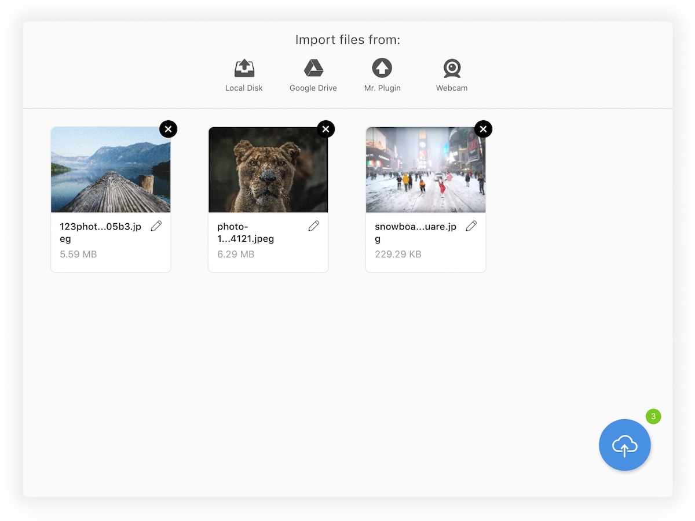

# Uppy


<a href="https://www.npmjs.com/package/uppy"></a>
<a href="https://www.npmjs.com/package/uppy"></a>
<a href="https://travis-ci.org/transloadit/uppy"></a>

Uppy is (going to be) a cool JavaScript file uploader that fetches files for you from local disk, Google Drive, Dropbox, Instagram, remote URLs, cameras and other exciting locations, and then uploads them to wherever you want. Uppy is being developed by the [Transloadit](https://transloadit.com) team because we want file uploading experience to be better — both for users and developers.

Check out [uppy.io](http://uppy.io/) for docs, API, examples and stats.

## Features

- Lightweight / easy on dependencies
- Usable as a bundle straight from a CDN as well as a module to import
- Resumable file uploads via the open [tus](http://tus.io/) standard
- Uppy speaks multiple languages (i18n support)
- Built with accessibility in mind
- Works great with file encoding and processing backends, such as [Transloadit](http://transloadit.com)
- Small core, modular plugin-based architecture.
- Cute as a puppy :dog:, also accepts cat pictures

## Demo



- [Full featured UI](http://uppy.io/examples/modal)
- [Simple Drag & Drop](http://uppy.io/examples/dragdrop)

## Usage

:warning: **Don’t use Uppy in production just yet, we’re working on it**

### Installing from NPM

It’s easy to start using Uppy, we recommend installing from npm:
`npm install uppy --save`

and then use a bundler like Browserify or Webpack:

``` javascript
// ES6
import { Core, DragDrop, Tus10 } from 'uppy'

const uppy = new Core({wait: false})
const files = uppy
  .use(DragDrop, {target: 'body'})
  .use(Tus10, {endpoint: 'http://master.tus.io:8080/files/'})
  .run()

// ES5
// :warning: bundling with `require` will include the whole Uppy package, with all plugins. If you want to pick and choose, use `import`):
var Uppy = require('uppy')

var uppy = new Uppy.Core({wait: false})
var files = uppy
  .use(Uppy.DragDrop, {target: 'body'})
  .use(Uppy.Tus10, {endpoint: 'http://master.tus.io:8080/files/'})
  .run()
```

Add CSS [uppy.min.css](https://unpkg.com/uppy/dist/uppy.min.css), either to `head` of your HTML or include in JS, if your bundler of choice supports it — transforms and plugins are available for Browserify and Webpack.

Give it a spin on RequireBin: http://requirebin.com/?gist=54e076cccc929cc567cb0aba38815105

### Installing from CDN

But if you like, you can also use a pre-built bundle, for example from [unpkg CDN](https://unpkg.com/uppy/). In that case `Uppy` will attach itself to the global `window` object.

1\. Add a script to your the bottom of your HTML’s `<body>`:

```
<script src="https://unpkg.com/uppy/dist/uppy.min.js"></script>
```

2\. Add CSS to your HTML’s `<head>`:
```
<link href="https://unpkg.com/uppy/dist/uppy.min.css" rel="stylesheet">
```

3\. Initialize:

``` javascript
<script>
  var uppy = new Uppy.Core({locales: Uppy.locales.ru_RU, debug: true})
  uppy.use(Uppy.DragDrop, {target: '.UppyDragDrop'})
  uppy.use(Uppy.Tus10, {endpoint: 'http://master.tus.io:3020/files/'})
  uppy.run()
</script>
```

## API

Uppy exposes events that you can subscribe to in your app:

### `core:upload-success` when one upload is complete:

``` javascript
uppy.on('core:upload-success', (fileId, url) => {
  console.log(url)
  var img = new Image()
  img.width = 300
  img.alt = fileId
  img.src = url
  document.body.appendChild(img)
})
```

### `core:success` when all uploads are complete:

``` javascript
uppy.on('core:success', (fileCount) => {
  console.log(fileCount)
})
```

## Browser Support

<a href="https://saucelabs.com/u/transloadit-uppy">
  
</a>

Note: we aim to support IE10+ and recent versions of Safari, Edge, Chrome, Firefox and Opera. IE6 on the chart above means we recommend setting Uppy to target a `<form>` element, so when Uppy has not yet loaded or is not supported, upload still works. Even on the refrigerator browser. Or, yes, IE6.

## FAQ

### React support?

Yep. It’s in the works.

## Contributions are welcome

 - Contributor’s guide in [`website/src/guide/contributing.md`](website/src/guide/contributing.md)
 - Architecture in [`website/src/api/architecture.md`](website/src/api/architecture.md)
 - Changelog to track our release progress (we aim to roll out a release every month): [`CHANGELOG.md`](CHANGELOG.md)

## License

[The MIT License](LICENSE).
